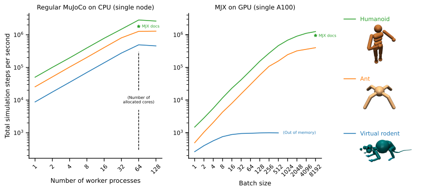
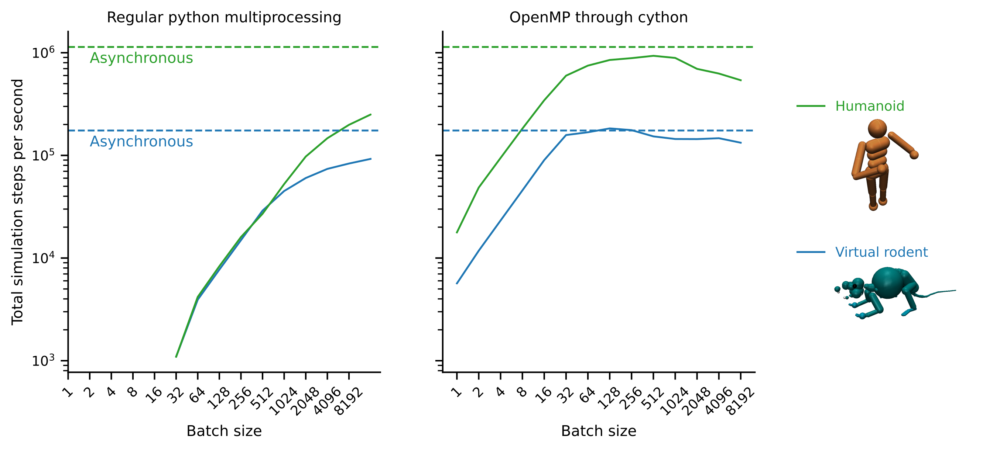

# My small benchmark of Mujuco and MJX
This is a repository with few a quick test scripts for testing the performance of the [MuJoCo](https://mujoco.org/) (CPU) and [MJX](https://mujoco.readthedocs.io/en/stable/mjx.html) (GPU) on our model of a virtual rodent. The tests are focused on parallelization of multiple environments on _a single node_ of the [FAS RC cluster](https://www.rc.fas.harvard.edu/), i.e. not any multi-node distributed set-up. Two simplified scenarios are explored: asynchronous/embarassingly-parallel simulations of parellel environments, and synchronous simulations where the state is collected in the main process in between each step.

## Models
For comparison, the tests were run on the MJX-adapted version of the rodent and some reference models: `ant.xml` and `humanoid.xml`, which were taken from OpenAI gym, and `humanoid_mjx.xml` which was bundled with MJX.

## Asynchronous simulations
The asynchronous simulations for MuJoCo are done in `mujoco_naive_multiprocessing.py`. It uses the standard library `multiprocessing` to run multiple environments in parallel. For MJX, the corresponding simulations are called from `mjx_naive.py`. 

## Synchronous simulations
The asynchronous simulations are potentially unfair to MJX, since a major feature of MJX is that simulation steps can very easily be intertwined with a control or RL inference step without leaving the GPU. Therefore, there are also some scipts to test what happens when each environment may only be stepped once before collecting the state (more precisely, the `qpos` and `qvel` vectors of each environment) in the main process. In the script `mujoco_single_step_multiprocessing.py`, this is done with multiprocessing with one process per core (32 or 64 depending on which node in the cluster happened to be free when I ran it), and batched environments in each process. Thus, the total batch size is a multiple of the number of process. The major issue with this approach is that when the number of environments per process is small, the interprocess communication and other python-level code dominates the compute time of the actual physics, and so the total number of simulated time-steps is fewer per unit of time.

As an alternative approach, I also tested parallelization with [Cython and OpenMP](https://cython.readthedocs.io/en/stable/src/userguide/parallelism.html). This script is in `test-calling-from-cython/quick_benchmark.py` and uses cython's `prange` loop (OpenMP under the hood) to call MuJuCo's step function for each environment. For this to work, the C/C++ version of Mujuco needs to be called directly from cython. Therefore, Mujuco binaries and headers need to be downloaded and placed in the `test-calling-from-cython` folder, and the binary added to the LD-path so that it can be linked. `setup.py` compiles the cython-code and links Mujuco. This is a very hacky way to interact with the simulator, as it bypasses its built-in python bindings, and should not be used in any code that needs more complete access to Mujuco -- or any semblance of maintainability, stability or portability. Nevertheless, it seems to show that it is in principle possible to get very good (almost linear?) scaling even with synchronous stepping of the environment if threading is done with OpenMP. For running RL environments on a single node, this could be an interesting approach.

This plot was generated on a cluster node with 32 allocated cores. The dotted lines show the asynchronous performance on the same node also with 32 allocated cores. The main conclusion is that for small-to-intermediate batch sizes, using OpenMP threading is several orders of magnitude faster, whereas the relative cost of the multiprocessing overhead decreases for very large batch sizes to the point where it may be in the same ballpark.
